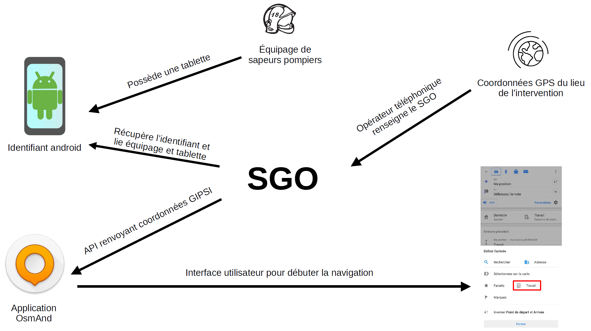

## Pour que ça fonctionne

Installer Android Studio.

Avoir les bonnes variables d'environnement:

* ANDROID_HOME=C:\Users\USER\AppData\Local\Android\Sdk
* JAVA_HOME=C:\Program Files\Java\jdk-19

Créer un fichier bat sur Windows et l'exécuter

```bash
@echo off
mkdir osmand
cd osmand
@REM git clone https://github.com/osmandapp/OsmAnd-resources.git resources
@REM https://github.com/yohann1c/OsmAnd-resources.git est en privé.
git clone https://github.com/yohann1c/OsmAnd-resources.git resources
git clone https://github.com/yohann1c/OsmAnd-SDIS33.git android
git clone https://github.com/osmandapp/OsmAnd-core.git core-legacy
git clone https://github.com/osmandapp/osmandapp.github.io help
cd android/OsmAnd
../gradlew --refresh-dependencies clean assembleAndroidFullLegacyFatDebug
```

Récupérer l'APK sur `./OSMAND/build/outputs/apk/AndroidFullLegacyFat/debug`

## Aller plus loin

* Remplacer le fichier `../resources/rendering_styles/default.render.xml` par un fichier render de son cru afin d'appliquer par défaut son style et lui donner le même nom.
* Ajouter par défaut ses données dès le lancement de l'application. On ajoute en amont son fichier dans le dossier `../../ressources/data` puis on écrit dans le fichier `build-common.gradle`

```gradle
tasks.register('gironde', Copy) {
	from("../../resources/data") {
		include "France_new-aquitaine_gironde_europe.obf"
	}
	into "assets"
}
```

Cette partie intégrera le fichier dans le dossier `./assets` mais ne l'intégrera pas aux fichiers d'application. Pour cela, il faut ajouter au fichier `../../ressources/bundled_assets.json`

```json
{
    "source": "France_new-aquitaine_gironde_europe.obf",
    "destination": "France_new-aquitaine_gironde_europe.obf",
    "mode": "alwaysOverwriteOrCopy"
},
```

Pour ajouter un mode de navigation, il faut modifier le fichier `../../ressources/routing/routing.xml`, copier coller un `routingProfile` et modifier les arguments `name` et éventuellement `baseProfile`. Il faudra ensuite modifier certains arguments concernant la navigation.

## Mise en place d'un bouton intervention

Afin de rendre la prise en main plus fluide pour les sapeurs pompiers, un bouton intervention peut être mis en place. Il ressemble à ça:


Ce bouton est en réalité un détournement du bouton travail. Il est connecté à une API relié au SGO donnant les coordonnées géographique (EPSG:4326) du lieu d'intervention.

Le fonctionnement du processus suit le schéma suivant:



Pour résumer, on a d'un côté un équipage de sapeurs pompiers qui possède une tablette ou un smartphone. Ce smartphone possède un identifiant à determiner (n° de série, IMEI, android_id ...). De l'autre côté on a le SGO (Système de Gestion Opérationnel qui détient en base l'identifiant de la flotte de tablettes et sait à quel équipage ou véhicule cette tablette est affectée. L'opérateur téléphonique renseigne dans le SGO le lieu d'intervention ainsi que les moyens nécessaires pour l'intervention. Cela va créer une réponse JSON lors de l'appel d'API qui sera récupérée par l'application OsmAnd via le bouton intervention qui est un détournement du bouton travail.

L'URL de l'API peut être changée sur le fichier: `OsmAnd/src/net/osmand/plus/routepreparationmenu/MapRouteInfoMenu.java` . Dans ce fichier, on a ce code:

```java
String androidId = DeviceUtils.getAndroidId(app.getApplicationContext());
String url = "https://67d97c3900348dd3e2ab4af0.mockapi.io/api/lieu_intervention/intervention?android_id=" + androidId; // Fake API
```

L'URL provient de `https://mockapi.io/projects` qui est un projet permettant de générer de fausses API sans utiliser de ressources internes afin de tester son application. Il n'y a plus qu'à remplacer l'URL par la véritable API. Quant au androidID, il peut être changer par le n°IMEI ou de série à condition d'installer l'application en application système. En effet, à partir de la version 10 d'Android, on ne peut plus accèder à ces données sans que l'application ne soit une application système.

Dans le fichier `OsmAnd/src/net/osmand/plus/routing/RoutingHelper.java`, un système permettant de supprimer automatiquement le lieu d'intervention une fois arrivé sur place a été mis en place. Pour être pris, le lieu d'intervention est supprimé à condition que le guidage vers le lieu d'intervention ait été activé et que le véhicule soit arrivé à destination. Dans certains cas, cette suppression n'est pas automatique (ex: le véhicule arrive à proximité de l'intervention mais se trouve bloqué par un obstacle). Pas de panique, la nouvelle intervention écrasera la précédente.

> La seule spécificité à laquelle il faudra prêter attention dans ce fichier est le système de précision des coordonnées. OsmAnd utilise une précision de 14 chiffres après la virgule pour les coordonnées tandis que dans l'API test, une précision de 6 chiffres a été utilisé. C'est la raison pour laquelle à la ligne 270 et 271, on norme les résultats avec ceux de l'API. On peut donc soit adapté son API pour qu'il y ait une précision de 6 chiffres après la virgule soit modifier le code afin qu'il accepte une plus grande ou plus petite précision.

## L'enregistrement d'itinéraire

L'extension d'enregistrement d'itinéraire est activé par défaut. Le logo  et  a été désactivé afin de rendre la carte plus lisible. On peut néanmoins l'activer manuellement en suivant la procédure ci-dessous.

[](https://youtu.be/RISVblIZhe4)

 <video width="640" height="360" controls>
  <source src="image/README/2025-04-04-12-49-35.mp4" type="video/mp4">
  Your browser does not support the video tag.
</video>

De plus l'enregistrement d'itinéraire est activé automatiquement dès que le guidage est actif et s'arrête dès que le guidage se finit. Dans le cas du SDIS 33, cela serait dans un but de RETEX (retour d'expérience), obtenir des données sur les vitesses de certains tronçons routier à certaines horaires, date, la justesse de la numérisation du graphe routier ...

OsmAnd (OSM Automated Navigation Directions)
--------------------------------------------

This project aims at providing comfortable map viewing and navigation (routing) application for mobile devices. Particular stress lies with complete offline features (via pre-loaded offline map data) or economic internet usage.
To get started, continue with the basic description below, then find more detail on our Welcome Wiki Pages, the Project Homepage, or the OpenStreetMap OsmAnd Wiki Page.
You are welcome to discuss any question regarding the project at the Google group OsmAnd. Please do not use comments on wiki pages because it is rather difficult to find them.

| Android markets                                                                                                                                                                                                |
| -------------------------------------------------------------------------------------------------------------------------------------------------------------------------------------------------------------- |
| `<a href="https://play.google.com/store/apps/dev?id=8483587772816822023" rel="Get it on Google Play">` `</a>` |
| `<a href="https://appgallery.huawei.com/#/app/C101486545" rel="Explore it on AppGallery">` `</a>`       |
| `<a href="https://www.amazon.com/s?i=mobile-apps&rh=p_4%3AOsmAnd&search-type=ss" rel="Get it on Amazon">` `</a>`       |
| `<a href="https://f-droid.org/packages/net.osmand.plus/" rel="Get it on F-Droid">` `</a>`                             |

| App Store - Apple                                                                                                                                                                                  |
| -------------------------------------------------------------------------------------------------------------------------------------------------------------------------------------------------- |
| `<a href="https://apps.apple.com/app/apple-store/id934850257" rel="Get it on AppStore">` `</a>` |

<p>
<a href="https://hosted.weblate.org/engage/osmand/">

</a>
</p>

Functionality
-------------

**OsmAnd (OSM Automated Navigation Directions)** is a map and navigation application with access to the free, worldwide, and high-quality OpenStreetMap (OSM) database.
All map data can be stored on your device's memory card for offline use.
Via your device's GPS, OsmAnd offers routing, with optical and voice guidance, for car, bike, and pedestrian usage.
All main functionalities work both online and offline (no internet needed).

## Some of the main features:

#### Navigation

* Works online (fast) or offline (no roaming charges when you are abroad)
* Turn-by-turn voice guidance (recorded and synthesized voices)
* Optional lane guidance, street name display, and estimated time of arrival
* Supports intermediate points on your itinerary
* Automatic re-routing whenever you deviate from the route
* Search for places by address, by type (e.g. restaurant, hotel, gas station, museum), or by geographical coordinates

#### Map Viewing

* Display your position and orientation on the map
* Optionally align the map according to compass or your direction of motion
* Save your most important places as Favorites
* Display POIs (point of interests) around you
* Can display specialized online tile maps
* Can display satellite view (from Bing)
* Can display different overlays like touring/navigation GPX tracks and additional maps with customizable transparency
* Optionally display place names in English, local, or phonetic spelling

#### Use OpenStreetMap and Wikipedia Data

* High quality information from the world's best collaborative projects
* Global maps from OpenStreetMap, available per country or region
* Wikipedia POIs, great for sightseeing (not available in free version)
* Unlimited free downloading, directly from the app (download limit is 16 map files in free version)
* Always up-to-date maps (updated at least once a month)
* Compact offline vector maps
* Select between complete map data and just road network (Example: All of Japan is 700 MB, or 200 MB for the road network only)
* Also supports online or cached tile maps

#### Safety Features

* Optional automated day/night view switching
* Optional speed limit display, with reminder if you exceed it
* Optional speed-dependent map zooming
* Share your location so that your friends can find you

#### Bicycle and Pedestrian Features

* The maps include foot, hiking, and bike paths (great for outdoor activities)
* Special routing and display modes for bike and pedestrian usage
* Optional public transport stops (bus, tram, train), including line names
* Optional trip recording to local GPX file or online service
* Optional speed and altitude display
* Display of contour lines and hill-shading (via additional paid plugin)

#### Directly Contribute to OpenStreetMap

* Report map bugs
* Upload GPX tracks to OSM directly from the app
* Add POIs and directly upload them to OSM (or later if offline)
* Optional trip recording in background mode (while device is in sleep mode)

#### Contribute to OsmAnd

OsmAnd is open-source and actively being developed.
Everyone can contribute to the application by reporting bugs, [improving translations](https://hosted.weblate.org/projects/osmand/), or coding new features.
The project experiences continuous improvement by all such forms of developer and user interaction.
The project progress also relies on financial contributions to fund the development, coding, and testing of new functionality.
By buying OsmAnd+ and subscribing to OsmAnd Pro (see https://osmand.net/docs/user/purchases/), you help the application become even more awesome!

The technical documentation on how to build OsmAnd can be found at https://www.osmand.net/docs/technical/build-osmand/

#### Map Coverage and Quality - How Good is OSM Data?

According to research, OSM map data rivals and often surpasses commercially available maps both in terms of data completeness and data actuality. This is indicated by different metrics like the amount of road distance mapped, or the number of objects like points of interest or buildings mapped. The fact that the maps are globally crowd-sourced ensures continuous improvements and updates, the incorporation of local on-the-ground expertise, and reflects things like neighborhood development, ongoing construction, or even the results of recent natural disasters.

Comparing the different metrics, it is safe to say that OSM maps cover all continents and countries globally for all your travel needs, and you will find their quality and completeness nothing less than stunning in the vast majority of countries. Latest research mentions only few countries in continental Asia and central Africa where e.g the incorporation of a noticeable portion or roadways is still ongoing to catch up with the high levels already reached anywhere else.

##### List of countries supported

Coverage is world wide, e.g.: Afghanistan, Albania, Algeria, Andorra, Angola, Anguilla,
Antigua and Barbuda, Argentina, Armenia, Aruba, Australia, Austria, Azerbaijan,
Bahamas, Bahrain, Bangladesh, Barbados, Belarus, Belgium, Belize, Benin, Bermuda,
Bhutan, Bolivia, Bonaire, Bosnia and Herzegovina, Botswana, Brazil,
British Virgin Islands, Brunei, Bulgaria, Burkina Faso, Burundi, Cambodia, Cameroon,
Canada, Cape Verde, Central African Republic, Chad, Chile, China, Colombia, Comoros,
Congo, Costa Rica, Croatia, Cuba, Curaçao, Cyprus, Czechia, Denmark, Djibouti, Dominica,
Dominican Republic, Ecuador, Egypt, El Salvador, Equatorial Guinea, Eritrea, Estonia,
Ethiopia, Fiji, Finland, France, French Guiana, French Polynesia, Gabon, Gambia,
Georgia, Germany, Ghana, Gibraltar, Greece, Greenland, Grenada, Guadeloupe, Guam,
Guatemala, Guernsey, Guinea, Guinea-Bissau, Guyana, Haiti, Vatican, Honduras, Hong Kong,
Hungary, Iceland, India, Indonesia, Iran, Iraq, Ireland, Isle of Man, Israel, Italy,
Ivory Coast, Jamaica, Japan, Jersey, Jordan, Kazakhstan, Kenya, Kiribati,
North Korea and South Korea, Kuwait, Kyrgyzstan, Laos, Latvia, Lebanon, Lesotho,
Liberia, Libya, Liechtenstein, Lithuania, Luxembourg, Macao, Macedonia, Madagascar,
Malawi, Malaysia, Maldives, Mali, Malta, Martinique, Mauritania, Mauritius, Mayotte,
Mexico, Micronesia, Moldova, Monaco, Mongolia, Montenegro, Montserrat, Morocco,
Mozambique, Myanmar, Namibia, Nauru, Nepal, Netherlands, Netherlands Antilles,
New Caledonia, New Zealand, Nicaragua, Niger, Nigeria, Norway, Oman, Pakistan, Palau,
Palestinian Territory, Panama, Papua New Guinea, Paraguay, Peru, Philippines, Poland,
Portugal, Puerto Rico, Qatar, Romania, Russia, Rwanda, Saint Barthelemy, Saint Helena,
Saint Kitts and Nevis, Saint Lucia, Saint Martin, Saint Pierre and Miquelon,
Saint Vincent and the Grenadines, Samoa, San Marino, Saudi Arabia, Senegal, Serbia,
Seychelles, Sierra Leone, Singapore, Slovakia, Slovenia, Somalia, South Africa,
South Georgia, South Sudan, Spain, Sri Lanka, Sudan, Suriname, Swaziland, Sweden,
Switzerland, Syria, Taiwan, Tajikistan, Tanzania, Thailand, Timor-Leste, Togo,
Tokelau, Tonga, Trinidad and Tobago, Tunisia, Turkey, Turkmenistan, Tuvalu, Uganda,
Ukraine, United Arab Emirates, United Kingdom (UK), United States of America (USA),
Uruguay, Uzbekistan, Vanuatu, Venezuela, Vietnam, Wallis and Futuna, Western Sahara,
Yemen, Zambia, Zimbabwe.
